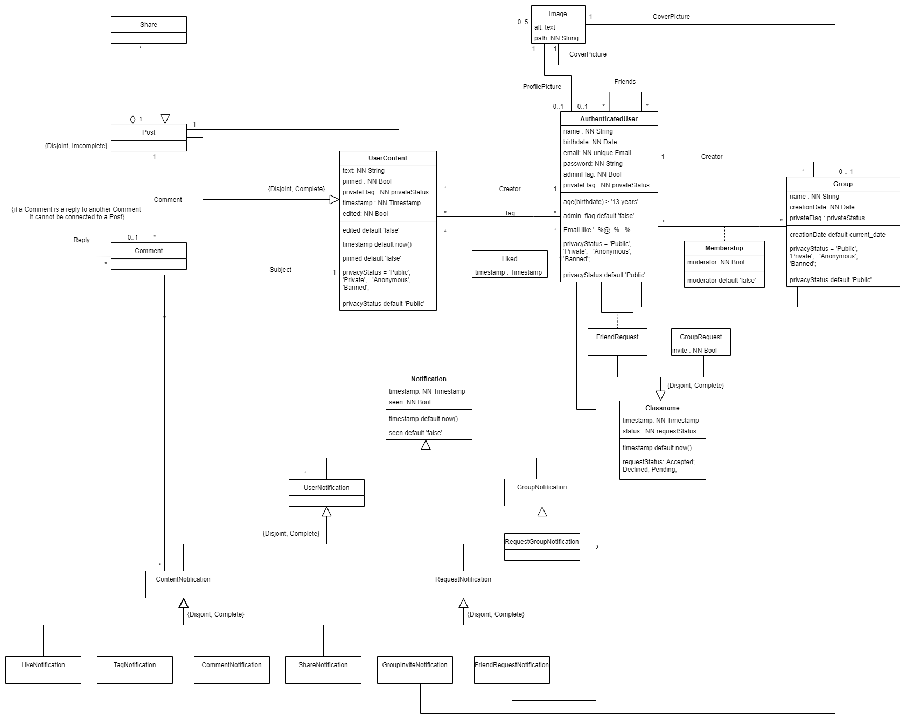

# EBD: Database Specification Component
---
## A4: Conceptual Data Model
---
The Conceptual Data Model contains the important classes of the database specified in a UML diagram. 


### 1. Class Diagram
---

Legend: NN = Not Null


### 2. Additional Business Rules
---
<p><strong>BR01</strong>: No Self Friendship. </p>
<p><strong>BR02</strong>: Add the creator of a group as a moderator. </p>
<p><strong>BR03</strong>: Create notifications for like, tag, share, comment, group_request and friend_request. </p>
<p><strong>BR04</strong>: Only the cretor of a contect can edit it. </p>
<p><strong>BR05</strong>: Delete a request if it has been denied or accepted and create a friendship or membership in case of acceptance. </p>


## A5: Relational Schema, Validation and Schema Refinement
---
The Relational Schema adapts the Conceptual Data Model to relations so a database can be established.

### 5.1 Relational Schema
---
|ID|Relation|
|--|--------|
|R01|image(id **PK**, alt, path **NN**)|
|R02|user(id **PK**, name **NN**, birthdate, email **UK NN**, password **NN**, admin_flag **NN DF** False, profile_pic -> image, cover_pic -> image, priv_stat **NN DF** 'Public' **CK** priv_stat **IN** privacy_status, **CT** email_formatting **CK** email **LIKE** '\_%@\_%.\_%', **CT** age(user) > 13)|
|R03|group(id **PK**, name **NN**, creation_date **NN DF** Today, cover_pic -> image, creator_id -> user, priv_stat **NN DF** 'Public' **CK** priv_stat **IN** privacy_status)|
|R04|friendship(user_1_id **PK** -> user, user_2_id **PK** -> user, **CT** no_self_friendship **CK** _user_1_ <> _user_2_)|
|R05|membership(user_id **PK** -> user, group_id **PK** -> group, moderator **DF** False)|
|R06|user_content(id **PK**, text, timestamp **NN DF** now(), creator_id -> user, edited **NN**, group_id -> group, pinned **NN**, priv_stat **NN DF** 'Public' **CK** priv_stat **IN** privacy_status, **CT** no_future_dates **CK** timestamp <= now()) |
|R07|post(id **PK** -> user_content, pic_1 -> image, pic_2 -> image, pic_3 -> image, pic_4 -> image, pic_5 -> image)|
|R08|comment(id **PK** -> user_content, parent_id -> user_content)|
|R09|share(id **PK** -> user_content, post_id -> post)|
|R10|tag(user_id **PK** -> user, content_id **PK** -> user_content)|
|R11|like(user_id **PK** -> user, content_id **PK** -> user_content)|
|R12|friend_request(requester_id **PK** -> user, target_id **PK** -> user, req_status **NN DF** 'Pending' **CK** req_status **IN** request_status, **CT** no_self_request **CK** requester <> target)|
|R13|group_request(requester_id **PK**-> user, target_id **PK** -> group, req_status **NN DF** 'Pending' **CK** req_status **IN** request_status, invite)|
|R14|like_notification(id **PK**, timestamp **NN DF** now(), seen **NN DF** False, sender_id -> user, content_id -> user_content, **CT** no_future_dates **CK** timestamp <= now())|
|R15|comment_notification(id **PK**, timestamp **NN DF** now(), seen **DF** False, comment_id -> comment, **CT** no_future_dates **CK** timestamp <= now())|
|R16|tag_notification(id **PK**, timestamp **NN DF** now(), seen **DF** False, content_id -> user_content, target_id -> user, **CT** no_future_dates **CK** timestamp <= now())|
|R17|share_notification(id **PK**, timestamp **NN DF** now(), seen **DF** False, share_id -> share)|
|R18|group_invite_notification(id **PK**, timestamp **NN DF** now(), seen **NN DF** False, group_id -> group, user_id -> user, **CT** no_future_dates **CK** timestamp <= now())|
|R19|group_request_notification(id **PK**, timestamp **NN DF** now(), seen **NN DF** False, group_id -> group, user_id -> user, **CT** no_future_dates **CK** timestamp <= now())|
|R20|friend_request_notification(id **PK**, timestamp **NN DF** now(), seen **NN DF** False, sender_id -> user, target_id -> user, **CT** no_future_dates **CK** timestamp <= now())|


Legend:
- PK = PRIMARY KEY
- UK = UNIQUE KEY
- NN = NOT NULL
- DF = DEFAULT
- CK = CHECK
- CT = CONSTRAINT

### 5.2 Domains
---
|Name|Definition|
|----|----------|
|today|DATE DEFAULT CURRENT_DATE|
|request_status|ENUM('Accepted', 'Declined', 'Pending')|
|privacy_status|ENUM('Public', 'Private', 'Anonymous', 'Banned')|

### 5.3 Schema Validation
---
|**Table R01** (image)||
|--|--------|
|**keys:**|{id}, {path}|
|**Functional Dependencies:**||
|FD0101|{id} -> {alt, path}|
|FD0201|{path} -> {id, alt}|
|**Normal Form**|BCNF|

|**Table R02** (user)||
|--|--------|
|**keys:**|{id}, {email}|
|**Functional Dependencies:**||
|FD0201|{id} -> {name, birthdate, email, password, admin_flag, profile_pic, cover_pic, priv_stat}|
|FD0202|{email} -> {id,name, birthdate, password, admin_flag, profile_pic, cover_pic, priv_stat}|
|**Normal Form**|BCNF|

|**Table R03** (group)||
|--|--------|
|**keys:**|{id}|
|**Functional Dependencies:**||
|FD0301|{id} -> {name, creation_date, cover_pic, creator_id, priv_stat}|
|**Normal Form**|BCNF|

|**Table R04** (friendship)||
|--|--------|
|**keys:**|{user_1_id, user_2_id}|
|**Functional Dependencies:**|_none_|
|**Normal Form**|BCNF|

|**Table R05** (membership)||
|--|--------|
|**keys:**|{user_id, group_id}|
|**Functional Dependencies:**||
|FD0501|{user_id, group_id} -> {moderator}|
|**Normal Form**|BCNF|

|**Table R06** (user_content)||
|--|--------|
|**keys:**|{id}|
|**Functional Dependencies:**||
|FD0601|{id} -> {text, timestamp, creator, edited, group_id, pinned, priv_stat}|
|**Normal Form**|BCNF|

|**Table R07** (post)||
|--|--------|
|**keys:**|{id}|
|**Functional Dependencies:**||
|FD0701|{id} -> {pic_1, pic_2, pic_3, pic_4, pic_5}|
|**Normal Form**|BCNF|

|**Table R08** (comment)||
|--|--------|
|**keys:**|{id}|
|**Functional Dependencies:**||
|FD0801|{id} -> {parent_id}|
|**Normal Form**|BCNF|

|**Table R09** (share)||
|--|--------|
|**keys:**|{id}|
|**Functional Dependencies:**||
|FD0901|{id} -> {post_id}|
|**Normal Form**|BCNF|

|**Table R10** (tag)||
|--|--------|
|**keys:**|{user_id, content_id}|
|**Functional Dependencies:**|_none_|
|**Normal Form**|BCNF|

|**Table R11** (like)||
|--|--------|
|**keys:**|{user_id, content_id}|
|**Functional Dependencies:**|_none_|
|**Normal Form**|BCNF|

|**Table R12** (friend_request)||
|--|--------|
|**keys:**|{requester_id, target_id}|
|**Functional Dependencies:**||
|FD1201|{requester_id, target_id} -> {req_status}|
|**Normal Form**|BCNF|

|**Table R13** (group_request)||
|--|--------|
|**keys:**|{user_id, group_id}|
|**Functional Dependencies:**||
|FD1301| {user_id, group_id} -> {req_status, invite}|
|**Normal Form**|BCNF|

|**Table R14** (like_notification)||
|--|--------|
|**keys:**|{id}|
|**Functional Dependencies:**||
|FD1401|{id} -> {timestamp, seen, sender_id, content_id}|
|**Normal Form**|BCNF|

|**Table R15** (comment_notification)||
|--|--------|
|**keys:**|{id}|
|**Functional Dependencies:**||
|FD1501|{id} -> {timestamp, seen, comment_id}|
|**Normal Form**|BCNF|

|**Table R16** (tag_notification)||
|--|--------|
|**keys:**|{id}|
|**Functional Dependencies:**||
|FD1601|{id} -> {timestamp, seen, content_id, target_id}|
|**Normal Form**|BCNF|

|**Table R17** (share_notification)||
|--|--------|
|**keys:**|{id}|
|**Functional Dependencies:**||
|FD1701|{id} -> {timestamp, seen, share_id}|
|**Normal Form**|BCNF|

|**Table R18** (group_invite_notification)||
|--|--------|
|**keys:**|{id}|
|**Functional Dependencies:**||
|FD1801|{id} -> {timestamp, seen, group_id, user_id}|
|**Normal Form**|BCNF|

|**Table R19** (friend_request_notification)||
|--|--------|
|**keys:**|{id}|
|**Functional Dependencies:**||
|FD1901|{id} -> {timestamp, seen, sender_id, target_id}|
|**Normal Form**|BCNF|

|**Table R20** (group_request_notification)||
|--|--------|
|**keys:**|{id}|
|**Functional Dependencies:**||
|FD2001|{id} -> {timestamp, seen, group_id, user_id}|
|**Normal Form**|BCNF|

## A6: Indexes, Integrity and Populated Database
---
Establish the expected database workload, indices to ensure good performance and search, and triggers to maintain data integrity.

### 1 Database Workload
---
|Relation reference|Relation name|Order of magnitude|Estimated growth|
|-|-|-|-|
|R01|image|hundreds|tens/day|
|R02|user|hundreds|tens/day|
|R03|group|tens|units/day|
|R04|friendship|thousands|dozens/day|
|R05|membership|hundreds|units/day|
|R06|user_content|thousands|tens/day|
|R07|post|hundreds|tens/day|
|R08|comment|hundreds|tens/day|
|R09|share|tens|units/day|
|R10|tag|tens|units/day|
|R11|likes|hundreds|tens/day|
|R12|friend_request|tens|units/day|
|R13|group_request|tens|units/day|
|R14|like_notification|hundreds|tens/day|
|R15|comment_notification|hundreds|tens/day|
|R16|tag_notification|tens|units/day|
|R17|share_notification|tens|units/day|
|R18|group_invite_notification|tens|units/day|
|R19|group_request_notification|tens|units/day|
|R20|friend_request_notification|tens|units/day|

### 2 Indices

#### 2.1 Full-text search indices
---
|**Index**|IDX01|
|-|-|
|**Relation**|user_content|
|**Attribute**|text|
|**Type**|GIST|
|**Cardinality**|High|
|**Clustering**|No|
|**Justification**|Table 'user_content' is very large. Helps full-text search.|
|**SQL Code**|```create index "user_content_text" on user_content using gist setweight(to_tsvector('english', "text"), 'A'));```|

|**Index**|IDX02|
|-|-|
|**Relation**|group|
|**Attribute**|name|
|**Type**|GIST|
|**Cardinality**|Medium|
|**Clustering**|No|
|**Justification**|Table 'group' is large. Searching for a group by its name is an important feature.|
|**SQL Code**|```create index "group_name_index" on "group" using gist setweight(to_tsvector('english', "name"), 'B');```|

### 2.2 Performance indices 
---
|**Index**|IDX03|
|-|-|
|**Relation**|user|
|**Attribute**|name|
|**Type**|Hash|
|**Cardinality**|Medium|
|**Clustering**|No|
|**Justification**|Table 'user' is large. Searching for a user by their name is an important feature.|
|**SQL Code**|```create index "user_name_index" on "user" using hash ("name");```|

|**Index**|IDX04|
|-|-|
|**Relation**|user_content|
|**Attribute**|creator_id|
|**Type**|Hash|
|**Cardinality**|Low|
|**Clustering**|No|
|**Justification**|Getting all posts from a giver user (creator) will be a frequent query and must be done quickly|
|**SQL Code**|```create index "user_content_creator_index" on user_content using hash(creator_id);```|

|**Index**|IDX05|
|-|-|
|**Relation**|user_content|
|**Attribute**|group_id|
|**Type**|Hash|
|**Cardinality**|Low|
|**Clustering**|No|
|**Justification**|Getting all posts in a giver group (group_id) will be a frequent query and must be done quickly|
|**SQL Code**|`create clustered index group_posts_index on user_content using hash (group_id);`|

|**Index**|IDX06|
|-|-|
|**Relation**|comment|
|**Attribute**|parent_id|
|**Type**|Hash|
|**Cardinality**|Low|
|**Clustering**|No|
|**Justification**|Getting all comments from a given parent will be a frequent query and must be done quickly|
|**SQL Code**|```create clustered index parent_comments_index on comment using hash (parent_id);```|

|**Index**|IDX07|
|-|-|
|**Relation**|like_notification|
|**Attribute**|content_id|
|**Type**|Hash|
|**Cardinality**|Low|
|**Clustering**|No|
|**Justification**|Getting all like notifications from a given content will be a frequent query and must be done quickly|
|**SQL Code**|```create clustered index like_notif_index on like_notification using hash (content_id);```|

|**Index**|IDX08|
|-|-|
|**Relation**|comment_notification|
|**Attribute**|comment_id|
|**Type**|Hash|
|**Cardinality**|Medium|
|**Clustering**|No|
|**Justification**|Getting all comment notifications from a given comment will be a frequent query and must be done quickly|
|**SQL Code**|```create clustered index comment_notif_index on comment_notification using hash (comment_id);```|

|**Index**|IDX09|
|-|-|
|**Relation**|tag_notification|
|**Attribute**|target_id|
|**Type**|Hash|
|**Cardinality**|Medium|
|**Clustering**|No|
|**Justification**|Getting all tag notifications for a given target will be a frequent query and must be done quickly|
|**SQL Code**|```create index tag_notif_index on tag_notification using hash (target_id);```|


|**Index**|IDX10|
|-|-|
|**Relation**|group_invite_notification|
|**Attribute**|user_id|
|**Type**|Hash|
|**Cardinality**|High|
|**Clustering**|No|
|**Justification**|Getting all invite notifications for a given user will be a frequent query and must be done quickly|
|**SQL Code**|```create index group_inv_notif_index on group_invite_notification using hash ("user_id");```|

|**Index**|IDX11|
|-|-|
|**Relation**|group_request_notification|
|**Attribute**|group_id|
|**Type**|Hash|
|**Cardinality**|Low|
|**Clustering**|No|
|**Justification**|Getting all request notifications for a given group will be a frequent query and must be done quickly|
|**SQL Code**|```create index group_req_notif_index on group_request_notification using hash (group_id);```|

|**Index**|IDX12|
|-|-|
|**Relation**|friend_request_notification|
|**Attribute**|target_id|
|**Type**|Hash|
|**Cardinality**|Medium|
|**Clustering**|No|
|**Justification**|Getting all request notifications for a given target will be a frequent query and must be done quickly|
|**SQL Code**|```create index friend_req_notif_index on friend_request_notification using hash (target_id);```|

### 3.Triggers
---
Triggers are used to enforce business rules.
| **Trigger** | **TRIGGER01** | 
| -- | -- |
| **Description** | Creates a like notification after insert on like |

``` sql
create or replace function create_like_notif_fn()
returns trigger as '
begin
    insert into "like_notification"(sender_id, content_id) 
           values (new.user_id, new.content_id);
    return null;
end; '
language plpgsql;

create trigger create_like_notification
after insert on "like" for each row
execute procedure create_like_notif_fn();
``` 

| **Trigger** | **TRIGGER02** | 
| -- | -- |
| **Description** | Create a comment notification after insert on comment|

``` sql
create or replace function create_comment_notif_fn()
returns trigger as '
begin
    insert into "comment_notification"(comment_id) 
           values (new.id);
    return null;
end; '
language plpgsql;

create trigger create_comment_notification
after insert on "comment" for each row
execute procedure create_comment_notif_fn();
```


| **Trigger** | **TRIGGER03** | 
| -- | -- |
| **Description** | Create a tag notification after insert on tag|

``` sql
create or replace function create_tag_notif_fn()
returns trigger as '
begin
	insert into "tag_notification"(content_id, target_id) 
               values(new.content_id, new.user_id);
	return null;
end'
language plpgsql;

create trigger create_tag_notification
after insert on "tag" for each row
execute procedure create_tag_notif_fn();
```

| **Trigger** | **TRIGGER04** | 
| -- | -- |
| **Description** | Create a share notification after insert on share|

``` sql
create or replace function create_share_notif_fn()
returns trigger as '
begin
    insert into share_notification(share_id) 
           values(new.id);
    return null;
end;'
language plpgsql;

create trigger create_share_notification
after insert on "share" for each row
execute procedure create_share_notif_fn();
```

| **Trigger** | **TRIGGER05** | 
| -- | -- |
| **Description** | Create a group request/invite notification after insert on group_request|

``` sql
create or replace function create_group_req_or_inv_notif_fn()
returns trigger as '
begin
	if (new.invite) then
    	   insert into group_invite_notification(group_id, user_id) 
                  values(new.group_id, new.user_id);
	else
           insert into group_request_notification(group_id, user_id) 
                  values(new.group_id, new.user_id);
	end if;
    return null;
end;'
language plpgsql;

create trigger create_group_inv_or_req_notification
after insert on "group_request" for each row
execute procedure create_group_req_or_inv_notif_fn();
```


| **Trigger** | **TRIGGER06** | 
| -- | -- |
| **Description** | Create a friend request notification after insert on friend_request|

``` sql
create or replace function create_friend_req_notif_fn()
returns trigger as '
begin
    insert into friend_request_notification(sender_id, target_id) 
           values(new.requester_id, new.target_id);
    return null;
end;'
language plpgsql;


create trigger create_friend_request_notification
after insert on "friend_request" for each row
execute procedure create_friend_req_notif_fn();
```

| **Trigger** | **TRIGGER07** | 
| -- | -- |
| **Description** | Create a membership to the creator of group |

``` sql
create or replace function add_founder_fn()
returns trigger as '
begin
    insert into membership(user_id, group_id, moderator) 
           values(new.creator_id, new.id, ''true'');
    return null;
end;'
language plpgsql;

drop trigger if exists add_founder_to_group on "group";

create trigger add_founder_to_group
after insert on "group" for each row
execute procedure add_founder_fn();
```

| **Trigger** | **TRIGGER08** | 
| -- | -- |
| **Description** | After updating req_stat from friend_request, if accepted add a new friendship and delete friend_request, else if declined delete friend_request |

``` sql
create or replace function check_new_friendship_fn()
returns trigger as '
begin
    if (new.req_stat = ''Accepted'') then
        insert into friendship(user_1, user_2) 
               values(new.requester_id, new.target_id);
        delete from friend_request 
               where requester_id = new.requester_id and target_id = new.target_id;
        return null;
    elsif (new.req_stat = ''Declined'') then
        delete from friend_request 
               where requester_id = new.requester_id and target_id = new.target_id;
        return null;
    else
        return null;
    end if;
end;'
language plpgsql;

create trigger add_friendship_on_friend_req_update
after update on "friend_request" for each row
execute procedure check_new_friendship_fn();
```

| **Trigger** | **TRIGGER09** | 
| -- | -- |
| **Description** | After updating req_stat from group_request, if accepted add a new membership and delete group_request, else if declined delete group_request|

``` sql
create or replace function check_new_membership_fn()
returns trigger as '
begin
    if (new.req_stat = ''Accepted'') then
        insert into membership(user_id, group_id) 
               values(new.user_id, new.group_id);
        delete from group_request 
               where user_id = new.user_id and group_id = new.group_id;
        return null;
    elsif (new.req_stat = ''Declined'') then
        delete from group_request 
               where user_id = new.user_id and group_id = new.group_id;
        return null;
    else
        return null;
    end if;
end;
'
language plpgsql;

create trigger add_membership_on_group_req_update
after update on "group_request" for each row
execute procedure  check_new_membership_fn();
```

### 4.Transactions
---
Transactions are used in order to ascertain the data's integrity

|**SQL Reference**| **Insert Post** |
|--|--|
| Justification | A transaction is used in order to mantain data integrity in the presence of simultaneous accesses. The isolation level is Repeatable Read since a concurrent may insert a new value into the user_content table, causing inconsistent data to be stored. |
| Isolation level | Repeatable Read |

``` sql 
BEGIN TRANSACTION;
SET TRANSACTION ISOLATION LEVEL REPEATABLE READ;

INSERT INTO user_content("text", "timestamp", creator_id, edited, group_id, pinned, priv_stat)
VALUES ($text, $timestamp, $creator_id, $edited, $group_id, $pinned, $priv_stat) 
RETURNING id as user_content_id;

INSERT INTO post(id, pic_1, pic_2, pic_3, pic_4, pic_5)
VALUES ($user_content_id, $pic_1, $pic_2, $pic_3, $pic_4, $pic_5);

COMMIT;
```

|**SQL Reference**| **Insert comment** |
|--|--|
| Justification |  A transaction is used in order to mantain data integrity in the presence of simultaneous accesses. The isolation level is Repeatable Read since a concurrent may insert a new value into the user_content table,causing inconsistent data to be stored.|
| Isolation level | Repeatable Read |
``` sql
BEGIN TRANSACTION;
SET TRANSACTION ISOLATION LEVEL REPEATABLE READ;

INSERT INTO user_content(id, "text", "timestamp", creator_id, edited, group_id, pinned, priv_stat)
VALUES ($text, $timestamp, $creator_id, $edited, $group_id, $pinned, $priv_stat) 
RETURNING id as user_content_id;

INSERT INTO comment(id, parent_id)
VALUES ($user_content_id, $parent_id);

COMMIT;
```

|**SQL Reference**| **Insert share** |
|--|--|
| Justification | A transaction is used in order to mantain data integrity in the presence of simultaneous accesses. The isolation level is Repeatable Read since a concurrent may insert a new value into the user_content table,
causing inconsistent data to be stored.|
| Isolation level | Repeatable Read |
``` sql 
BEGIN TRANSACTION;
SET TRANSACTION ISOLATION LEVEL REPEATABLE READ;

INSERT INTO user_content(id, "text", "timestamp", creator_id, edited, group_id, pinned, priv_stat)
VALUES ($text, $timestamp, $creator_id, $edited, $group_id, $pinned, $priv_stat) 
RETURNING id as user_content_id;

INSERT INTO share(id, post_id)
VALUES ($user_content_id, $post_id);

COMMIT;
```

|**SQL Reference**| **Search Content** |
|--|--|
| Justification | If a search results ends up being deleted by another transaction running simultaniously, then errors might occur during the search of the deleted items or the user might be presented with Phantom Content. The isolation level is SERIALIZABLE READ ONLY because it only uses SELECT's.|
| Isolation level | Serializable Read Only |
``` sql
BEGIN TRANSACTION;
SET TRANSACTION ISOLATION LEVEL SERIALIZABLE READ ONLY;

SELECT (SELECT "name"
		FROM "user"
		WHERE "user".id = "user_content".creator_id) AS Creator, 
		text AS "Content/Group Name"
FROM (SELECT id, ts_rank(setweight(to_tsvector('english', user_content."text"), 'A'), to_tsquery('english', $search)) AS rank
	  FROM user_content
	  WHERE to_tsvector('english', user_content.text) @@ to_tsquery('english', $search) 
              AND priv_stat = 'Public'
	  GROUP BY id, creator_id
	  ORDER BY rank DESC) AS results INNER JOIN "user_content" 
              ON (results.id = "user_content".id)

UNION
			  
	  
SELECT (SELECT "name"
		FROM "user"
		WHERE "user".id = "group".creator_id) AS Creator, 
		"name" AS "Content/Group Name"
FROM (SELECT id, ts_rank(setweight(to_tsvector('english', "group"."name"), 'B'), to_tsquery('english', $search)) AS rank
	  FROM "group"
	  WHERE to_tsvector('english', "group"."name") @@ to_tsquery('english', $search) 
              AND priv_stat = 'Public'
	  GROUP BY id
	  ORDER BY rank DESC) AS results INNER JOIN "group" 
              ON (results.id = "group".id);

COMMIT;

```

## Annex A. Complete SQL Code
---

### A.1 Database Schema
---
``` sql
set search_path to lbaw2192;

drop table if exists "image" cascade;
drop table if exists "user" cascade;
drop table if exists "group" cascade;
drop table if exists "friendship" cascade;
drop table if exists "membership" cascade;
drop table if exists "user_content" cascade;
drop table if exists "post" cascade;
drop table if exists "comment" cascade;
drop table if exists "share" cascade;
drop table if exists "tag" cascade;
drop table if exists "like" cascade;
drop table if exists "friend_request" cascade;
drop table if exists "group_request" cascade;
drop table if exists "like_notification" cascade;
drop table if exists "comment_notification" cascade;
drop table if exists "tag_notification" cascade;
drop table if exists "share_notification" cascade;
drop table if exists "group_invite_notification" cascade;
drop table if exists "group_request_notification" cascade;
drop table if exists "friend_request_notification" cascade;

drop type if exists request_status cascade;
drop type if exists privacy_status cascade;

create type request_status as ENUM (
    'Accepted',
    'Declined',
    'Pending'
);

create type privacy_status as ENUM (
    'Public',
    'Private',
    'Anonymous',
	'Banned'
);

create table "image"
(
    id serial primary key,
    alt text,
    "path" text not null
);

create table "user"
(
    id serial,
    "name" text not null,
    birthdate date not null check (age(birthdate) >= '13 years'),
    email text not null unique,
    "password" text not null,
    admin_flag boolean not null default 'false',
    profile_pic integer,
    cover_pic integer,
    priv_stat privacy_status not null default 'Public',
	primary key(id),
    constraint email_formatting check (email like '_%@_%._%'),
	constraint fk_profile_pic foreign key(profile_pic) references image(id) on delete set null,
	constraint fk_cover_pic foreign key(cover_pic) references image(id) on delete set null
);

create table "group"
(
    id serial primary key,
    "name" text not null,
    creation_date date not null default current_date,
    cover_pic integer,
    creator_id integer not null,
    priv_stat privacy_status not null default 'Public',
	constraint fk_cover_pic foreign key(cover_pic) references image(id) on delete set null,
    constraint fk_creator_id foreign key(creator_id) references "user"(id) on delete set null
);

create table "friendship"
(
    user_1 integer,
    user_2 integer,
    primary key(user_1, user_2),
    constraint no_self_friendship check (user_1 <> user_2),
	constraint fk_user_1 foreign key(user_1) references "user"(id) on delete cascade,
	constraint fk_user_2 foreign key(user_2) references "user"(id) on delete cascade
);

create table "membership"
(
    user_id integer,
    group_id integer,
    moderator boolean not null default 'false',
    primary key (user_id, group_id),
	constraint fk_user foreign key(user_id) references "user"(id) on delete cascade,
	constraint fk_group foreign key(group_id) references "group"(id) on delete cascade
);

create table "user_content"
(
    id serial primary key,
    "text" text not null,
    "timestamp" timestamptz not null default Now(),
    creator_id integer not null,
    edited boolean not null default 'false',
    group_id integer,
    pinned boolean not null default 'false',
    priv_stat privacy_status not null,
	constraint fk_creator_id foreign key(creator_id) references "user"(id) on delete cascade,
	constraint fk_group_id foreign key(group_id) references "group"(id) on delete cascade,
    constraint no_future_dates check ("timestamp" <= now())
);

create table "post"
(
    id integer,
    pic_1 integer,
    pic_2 integer,
    pic_3 integer,
    pic_4 integer,
    pic_5 integer,
    primary key (id),
	constraint fk_id foreign key(id) references user_content(id) on delete cascade,
	constraint fk_pic_1 foreign key(pic_1) references "image"(id) on delete set null,
	constraint fk_pic_2 foreign key(pic_2) references "image"(id) on delete set null,
	constraint fk_pic_3 foreign key(pic_3) references "image"(id) on delete set null,
	constraint fk_pic_4 foreign key(pic_4) references "image"(id) on delete set null,
	constraint fk_pic_5 foreign key(pic_5) references "image"(id) on delete set null
);

create table "comment"
(
    id integer,
    parent_id integer,
    primary key (id),
	constraint fk_id foreign key(id) references user_content(id) on delete cascade,
	constraint fk_parent_id foreign key(parent_id) references user_content(id) on delete cascade
);

create table "share"
(
    id integer,
    post_id integer,
    primary key (id),
	constraint fk_id foreign key(id) references user_content(id) on delete cascade,
	constraint fk_post_id foreign key(post_id) references post(id)	
);

create table "tag"
(
    user_id integer,
    content_id integer,
    primary key (user_id, content_id),
	constraint fk_user_id foreign key(user_id) references "user"(id),
	constraint fk_content_id foreign key(content_id) references user_content(id)
);

create table "like"
(
    user_id integer,
    content_id integer,
    primary key ("user_id", content_id),
	constraint fk_user_id foreign key(user_id) references "user"(id),
	constraint fk_content_id foreign key(content_id) references user_content(id)
);

create table "friend_request"
(
    requester_id integer,
    target_id integer,
    req_stat request_status not null default 'Pending',
    primary key (requester_id, target_id),
	constraint fk_requester_id foreign key(requester_id) references "user"(id),
	constraint fk_target_id foreign key(target_id) references "user"(id)
);

create table "group_request"
(
    user_id integer,
    group_id integer,
    req_stat request_status not null default 'Pending',
    invite boolean not null,
    primary key (user_id, group_id),
	constraint fk_user_id foreign key(user_id) references "user"(id),
	constraint fk_group_id foreign key(group_id) references "group"(id)
);

create table "like_notification"
(
    id serial primary key,
    "timestamp" timestamptz not null default now(),
    seen boolean not null default 'false',
    sender_id integer not null,            
    content_id integer not null,
	constraint fk_sender_id foreign key(sender_id) references "user"(id),
	constraint fk_content_id foreign key(content_id) references user_content(id),
    constraint no_future_dates check ("timestamp" <= now())
);

create table "comment_notification"
(
    id serial primary key,
    "timestamp" timestamptz not null default now(),
    seen boolean not null default 'false',        
    comment_id integer not null,
	constraint fk_comment_id foreign key(comment_id) references "comment"(id),
    constraint no_future_dates check ("timestamp" <= now())
);

create table "tag_notification"
(
    id serial primary key,
    "timestamp" timestamptz not null default now(),
    seen boolean not null default 'false',         
    content_id integer not null,
    target_id integer not null,
	constraint fk_content_id foreign key(content_id) references user_content(id),
	constraint fk_target_id foreign key(target_id) references "user"(id),
    constraint no_future_dates check ("timestamp" <= now())
);

create table "share_notification"
(
    id serial primary key,
    "timestamp" timestamptz not null default now(),
    seen boolean not null default 'false',
    share_id integer not null,
	constraint fk_share_id foreign key(share_id) references "share"(id),
    constraint no_future_dates check ("timestamp" <= now())
);

create table "group_invite_notification"
(
    id serial primary key,
    "timestamp" timestamptz not null default now(),
    seen boolean not null default 'false',
    group_id integer not null,
    user_id integer not null,
	constraint fk_group_id foreign key(group_id) references "group"(id),
	constraint fk_user_id foreign key(user_id) references "user"(id),
	constraint no_future_dates check ("timestamp" <= now())
);

create table "friend_request_notification"
(
    id serial primary key,
    "timestamp" timestamptz not null default now(),
    seen boolean not null default 'false',
    sender_id integer not null,
    target_id integer not null,
	constraint fk_sender_id foreign key(sender_id) references "user"(id),
	constraint fk_target_id foreign key(target_id) references "user"(id),
    constraint no_future_dates check ("timestamp" <= now())
);

create table "group_request_notification"
(
    id serial primary key,
    "timestamp" timestamptz not null default now(),
    seen boolean not null default 'false',
    group_id integer not null,
    "user_id" integer not null,
	constraint fk_group_id foreign key(group_id) references "group"(id),
	constraint fk_user_id foreign key("user_id") references "user"(id),
    constraint no_future_dates check ("timestamp" <= now())
);

drop index if exists "group_posts_index";
drop index if exists "parent_comments_index";
drop index if exists "like_notif_index";
drop index if exists "comment_notif_index";
drop index if exists "tag_notif_index";
drop index if exists "group_inv_notif_index";
drop index if exists "group_req_notif_index";
drop index if exists "friend_req_notif_index";
drop index if exists "user_name_index";
drop index if exists "group_name_index";
drop index if exists "user_content_text";
drop index if exists "user_content_creator_index";

create index "user_name_index" on "user" using hash ("name");

create index "group_name_index" on "group" using gist (setweight(to_tsvector('english', "name"), 'B'));

create index "user_content_text" on user_content using gist (setweight(to_tsvector('english', "text"), 'A'));

create index "user_content_creator_index" on user_content using hash(creator_id);

create index "group_posts_index" on user_content using hash (group_id);

create index "parent_comments_index" on comment using hash (parent_id);

create index "like_notif_index" on like_notification using hash (content_id);

create index "comment_notif_index" on comment_notification using hash (comment_id);

create index "tag_notif_index" on tag_notification using hash (target_id);

create index "group_inv_notif_index" on group_invite_notification using hash (user_id);

create index "group_req_notif_index" on group_request_notification using hash (group_id);

create index "friend_req_notif_index" on friend_request_notification using hash (target_id);

-- Make data anonymous on user_content delete
create or replace function user_content_delete_fn(content_id integer)
returns integer as '
begin
	update "user_content" set priv_stat = ''Anonymous'' where id=content_id;
	return 0;
end;'
language plpgsql;

-- Make data anonymous on user delete
create or replace function user_delete_fn(u_id integer)
returns integer as '
begin
	update "user" set priv_stat = ''Anonymous'' where id=u_id;	
	update "user_content" set priv_stat = ''Anonymous'' where creator_id=u_id;
	return 0;
end;'
language plpgsql;

-- Make data anonymous on group delete
create or replace function group_delete_fn(g_id integer)
returns integer as '
begin
	update "group" set priv_stat = ''Anonymous'' where id=g_id;
	update "user_content" set priv_stat = ''Anonymous'' where group_id=g_id;
	return 0;
end;'
language plpgsql;

create or replace function create_like_notif_fn()
returns trigger as '
begin
    insert into "like_notification"(sender_id, content_id) values (new.user_id, new.content_id);
	return null;
end; '
language plpgsql;

drop trigger if exists create_like_notification on "like";

create trigger create_like_notification
after insert on "like" for each row
execute procedure create_like_notif_fn();

create or replace function create_comment_notif_fn()
returns trigger as '
begin
    insert into "comment_notification"(comment_id) values (new.id);
	return null;
end; '
language plpgsql;

drop trigger if exists create_comment_notification on "comment";

create trigger create_comment_notification
after insert on "comment" for each row
execute procedure create_comment_notif_fn();

create or replace function create_tag_notif_fn()
returns trigger as '
begin
	insert into "tag_notification"(content_id, target_id) values(new.content_id, new.user_id);
	return null;
end'
language plpgsql;

drop trigger if exists create_tag_notification on "tag";

create trigger create_tag_notification
after insert on "tag" for each row
execute procedure create_tag_notif_fn();

create or replace function create_share_notif_fn()
returns trigger as '
begin
    insert into share_notification(share_id) values(new.id);
    return null;
end;'
language plpgsql;

drop trigger if exists create_share_notification on "share";

create trigger create_share_notification
after insert on "share" for each row
execute procedure create_share_notif_fn();

create or replace function create_group_req_or_inv_notif_fn()
returns trigger as '
begin
	if (new.invite) then
    	insert into group_invite_notification(group_id, user_id) values(new.group_id, new.user_id);
	else
		insert into group_request_notification(group_id, user_id) values(new.group_id, new.user_id);
	end if;
    return null;
end;'
language plpgsql;

drop trigger if exists create_group_inv_or_req_notification on "group_request";

create trigger create_group_inv_or_req_notification
after insert on "group_request" for each row
execute procedure create_group_req_or_inv_notif_fn();

create or replace function create_friend_req_notif_fn()
returns trigger as '
begin
    insert into friend_request_notification(sender_id, target_id) values(new.requester_id, new.target_id);
	return null;
end;'
language plpgsql;

drop trigger if exists create_friend_request_notification on "friend_request";

create trigger create_friend_request_notification
after insert on "friend_request" for each row
execute procedure create_friend_req_notif_fn();

create or replace function add_founder_fn()
returns trigger as '
begin
    insert into membership(user_id, group_id, moderator) values(new.creator_id, new.id, ''true'');
	return null;
end;'
language plpgsql;

drop trigger if exists add_founder_to_group on "group";

create trigger add_founder_to_group
after insert on "group" for each row
execute procedure add_founder_fn();

create or replace function check_new_friendship_fn()
returns trigger as '
begin
    if (new.req_stat = ''Accepted'') then
        insert into friendship(user_1, user_2) values(new.requester_id, new.target_id);
        delete from friend_request where requester_id = new.requester_id and target_id = new.target_id;
        return null;
    elsif (new.req_stat = ''Declined'') then
        delete from friend_request where requester_id = new.requester_id and target_id = new.target_id;
        return null;
    else
        return null;
    end if;
end;'
language plpgsql;

drop trigger if exists add_friendship_on_friend_req_update on "friend_request";

create trigger add_friendship_on_friend_req_update
after update on "friend_request" for each row
execute procedure check_new_friendship_fn();

create or replace function check_new_membership_fn()
returns trigger as '
begin
    if (new.req_stat = ''Accepted'') then
        insert into membership(user_id, group_id) values(new.user_id, new.group_id);
        delete from group_request where user_id = new.user_id and group_id = new.group_id;
        return null;
    elsif (new.req_stat = ''Declined'') then
        delete from group_request where user_id = new.user_id and group_id = new.group_id;
        return null;
    else
        return null;
    end if;
end;
'
language plpgsql;

drop trigger if exists add_membership_on_group_req_update on "group_request";

create trigger add_membership_on_group_req_update
after update on "group_request" for each row
execute procedure  check_new_membership_fn();


```

---
### A.2 Database Population
---
``` sql
insert into "user"(id, "name", birthdate, email, "password") values(1, 'Andre', '2001-03-15', 'a@a.a', 'pass');
insert into "user"(id, "name", birthdate, email, "password") values(2, 'Tiago', '2001-05-11', 't@t.t', 'pass');
insert into "user"(id, "name", birthdate, email, "password") values(3, 'Diogo', '2001-11-30', 'd@d.d', 'pass');
insert into "user"(id, "name", birthdate, email, "password") values(4, 'Mendes', '1998-10-21', 'm@m.m', 'pass');
insert into "user"(id, "name", birthdate, email, "password") values(5, 'Ana', '2000-02-23', 'ana@a.a', '1234567');
insert into "user"(id, "name", birthdate, email, "password") values(6, 'Miguel', '1997-01-01', 'miguel@mig.m', 'passe');
insert into "user"(id, "name", birthdate, email, "password") values(7, 'Joao', '2003-07-05', 'j@j.j', 'passsss');
insert into "user"(id, "name", birthdate, email, "password") values(8, 'Pedro', '1999-09-19', 'p@p.p', 'palavrapasse');
insert into "user"(id, "name", birthdate, email, "password") values(9, 'Maria', '1998-12-23', 'maria@m.ma', 'sim123');
insert into "user"(id, "name", birthdate, email, "password") values(10, 'Carlos', '2000-04-01', 'car@car.car', 'teste');
insert into "user"(id, "name", birthdate, email, "password") values(11, 'Sara', '1999-03-20', 's@s.s', 'teste123');
insert into "user"(id, "name", birthdate, email, "password") values(12, 'Manuel', '2002-01-13', 'man@man.m', 'exemplo');
insert into "user"(id, "name", birthdate, email, "password") values(13, 'Sofia', '1996-08-11', 'sof@sof.s', 'example');
insert into "user"(id, "name", birthdate, email, "password") values(14, 'Fernando', '1997-03-07', 'f@f.f', 'yup123');
insert into "user"(id, "name", birthdate, email, "password") values(15, 'Ariana', '2000-09-22', 'ari@ari.ari', 'naosei');
insert into "user"(id, "name", birthdate, email, "password") values(16, 'Julio', '1995-10-31', 'jul@jul.j', 'esqueci_me');
insert into "user"(id, "name", birthdate, email, "password") values(17, 'Paula', '2000-06-25', 'pa@pa.pa', 'strongpass');
insert into "user"(id, "name", birthdate, email, "password") values(18, 'Marco', '1998-03-18', 'mar@mar.mar', 'lockedin');
insert into "user"(id, "name", birthdate, email, "password") values(19, 'Alice', '1999-09-23', 'ali@ali.a', '123exemplo');
insert into "user"(id, "name", birthdate, email, "password") values(20, 'Rui', '1999-09-19', 'r@ru.rui', '123321');
insert into "user"(id, "name", birthdate, email, "password") values(21, 'Carolina', '2002-10-04', 'carol@c.car', 'numeros');

insert into "friendship"(user_1, user_2) values(2,8);
insert into "friendship"(user_1, user_2) values(8,14);
insert into "friendship"(user_1, user_2) values(1,3);
insert into "friendship"(user_1, user_2) values(2,16);
insert into "friendship"(user_1, user_2) values(10,6);
insert into "friendship"(user_1, user_2) values(7,1);
insert into "friendship"(user_1, user_2) values(8,3);
insert into "friendship"(user_1, user_2) values(16,12);
insert into "friendship"(user_1, user_2) values(12,18);
insert into "friendship"(user_1, user_2) values(3,5);

insert into "group"(id, "name", creator_id) values(1, 'FEUP', 1);
insert into "group"(id, "name", creator_id) values(2, 'TechNerds', 1);
insert into "group"(id, "name", creator_id) values(3, 'HarryPotter Fans', 2);
insert into "group"(id, "name", creator_id) values(4, 'Book Geeks', 3);
insert into "group"(id, "name", creator_id) values(5, 'Gaming Community', 3);
insert into "group"(id, "name", creator_id) values(6, 'Influencers', 4);
insert into "group"(id, "name", creator_id) values(7, 'FoodLovers', 4);
insert into "group"(id, "name", creator_id) values(8, '_ShareMusic_', 4);
insert into "group"(id, "name", creator_id) values(9, 'MathGeniuses', 3);
insert into "group"(id, "name", creator_id) values(10, 'AnimeAddicted', 1);

insert into "membership"(user_id, group_id) values(2,1);
insert into "membership"(user_id, group_id) values(2,2);
insert into "membership"(user_id, group_id) values(2,4);
insert into "membership"(user_id, group_id) values(2,5);
insert into "membership"(user_id, group_id) values(2,6);
insert into "membership"(user_id, group_id) values(2,7);
insert into "membership"(user_id, group_id) values(2,8);
insert into "membership"(user_id, group_id) values(2,9);
insert into "membership"(user_id, group_id) values(2,10);
insert into "membership"(user_id, group_id) values(1,5);

insert into "user_content"(id, "text", creator_id, group_id, priv_stat) values(1, 'Hi!', 1, 2, 'Public');
insert into "user_content"(id, "text", creator_id, group_id, priv_stat) values(2, 'My recent trip was quite satisfying!', 2, null, 'Private');
insert into "user_content"(id, "text", creator_id, group_id, priv_stat) values(3, 'Your mission is not just difficult, it is impossible.', 3, 5, 'Public');
insert into "user_content"(id, "text", creator_id, group_id, priv_stat) values(4, 'The word SUN has only one syllable.', 1, 6, 'Public');
insert into "user_content"(id, "text", creator_id, group_id, priv_stat) values(5, 'Hi! It is often said that cats have nine lives but that is really just a myth.', 5, 1, 'Public');
insert into "user_content"(id, "text", creator_id, group_id, priv_stat) values(6, 'Clowns like to display humor!', 2, null, 'Private');
insert into "user_content"(id, "text", creator_id, group_id, priv_stat) values(7, 'I have been busier these days due to having a lot on my plate.', 5, 3, 'Public');
insert into "user_content"(id, "text", creator_id, group_id, priv_stat) values(8, 'This... is... delicious!', 4, null, 'Public');
insert into "user_content"(id, "text", creator_id, group_id, priv_stat) values(9, 'I finally got a new bike!', 7, null, 'Private');
insert into "user_content"(id, "text", creator_id, group_id, priv_stat) values(10, 'Thank you for repaying the favor when you didnt have to.', 1, 7, 'Public');
insert into "user_content"(id, "text", creator_id, group_id, priv_stat) values(11, 'Share', 1, null, 'Public');

insert into "post"(id) values(1);
insert into "post"(id) values(2);
insert into "post"(id) values(3);
insert into "post"(id) values(4);
insert into "post"(id) values(5);

insert into "comment"(id, parent_id) values(6, 2);
insert into "comment"(id, parent_id) values(8, 2);
insert into "comment"(id, parent_id) values(9, 2);

insert into "share"(id, post_id) values(10,2);

insert into "tag"(user_id, content_id) values(3, 1);
insert into "tag"(user_id, content_id) values(5, 7);
insert into "tag"(user_id, content_id) values(2, 1);
insert into "tag"(user_id, content_id) values(8, 10);
insert into "tag"(user_id, content_id) values(7, 5);
insert into "tag"(user_id, content_id) values(1, 1);
insert into "tag"(user_id, content_id) values(6, 3);
insert into "tag"(user_id, content_id) values(9, 3);
insert into "tag"(user_id, content_id) values(2, 5);
insert into "tag"(user_id, content_id) values(10, 10);

insert into "like"(user_id, content_id) values(1, 3);
insert into "like"(user_id, content_id) values(16, 2);
insert into "like"(user_id, content_id) values(7, 7);
insert into "like"(user_id, content_id) values(4, 8);
insert into "like"(user_id, content_id) values(10, 1);
insert into "like"(user_id, content_id) values(1, 7);
insert into "like"(user_id, content_id) values(8, 7);
insert into "like"(user_id, content_id) values(8, 6);
insert into "like"(user_id, content_id) values(13, 4);
insert into "like"(user_id, content_id) values(18, 1);

insert into "friend_request"(requester_id, target_id) values(18, 2);
insert into "friend_request"(requester_id, target_id) values(15, 10);
insert into "friend_request"(requester_id, target_id) values(6, 11);
insert into "friend_request"(requester_id, target_id) values(7, 8);
insert into "friend_request"(requester_id, target_id) values(12, 7);
insert into "friend_request"(requester_id, target_id) values(19, 5);
insert into "friend_request"(requester_id, target_id) values(5, 1);
insert into "friend_request"(requester_id, target_id) values(1, 17);
insert into "friend_request"(requester_id, target_id) values(4, 19);
insert into "friend_request"(requester_id, target_id) values(14, 3);

insert into "group_request"(user_id, group_id, invite) values(1, 3, true);
insert into "group_request"(user_id, group_id, invite) values(3, 6, false);
insert into "group_request"(user_id, group_id, invite) values(5, 1, true);
insert into "group_request"(user_id, group_id, invite) values(7, 2, true);
insert into "group_request"(user_id, group_id, invite) values(9, 7, false);
insert into "group_request"(user_id, group_id, invite) values(11, 9, false);
insert into "group_request"(user_id, group_id, invite) values(13, 10, true);
insert into "group_request"(user_id, group_id, invite) values(15, 3, false);
insert into "group_request"(user_id, group_id, invite) values(17, 4, false);
insert into "group_request"(user_id, group_id, invite) values(19, 5, true);

```


---

## Revision history

---

GROUP2192, 1/12/2021

* André de Jesus Fernandes Flores, up201907001@edu.fe.up.pt
* Diogo Luís Araújo de Faria, up201907014@edu.fe.up.pt 
* Diogo Rafael Amorim Mendes, up201605360@edu.fe.up.pt (Editor)
* Tiago André Batista Rodrigues, up201906807@edu.fe.up.pt